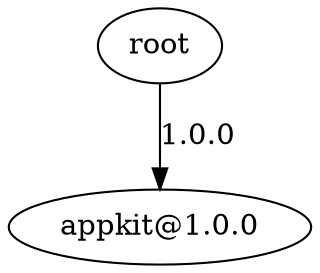

# MoonDepSolve

[](https://github.com/python123-ops/moondepsolve/actions/workflows/ci.yml)
[](LICENSE)
[](CHANGELOG.md)

MoonDepSolve 是一个面向 MoonBit 包生态的语义版本与依赖求解基础库。它提供语义版本解析、版本范围匹配、确定性传递依赖求解、稳定 lock、结构化依赖图和冲突报告，可作为包管理器、构建工具、依赖审计与教学项目的基础组件。

MoonDepSolve is a compact MoonBit library for semantic versions, deterministic dependency resolution, dependency graphs, and structured conflict reports.

- GitLink 主仓库：<https://gitlink.org.cn/python123/moondepsolve>
- GitHub 镜像：<https://github.com/python123-ops/moondepsolve>
- Mooncakes：`v0.2.0` 元数据已准备，登录后执行 dry-run，实际发布前补充包链接
- 维护者与唯一提交身份：`python123 <python123@users.noreply.gitlink.org.cn>`

## 功能

- 解析与比较 `1.2.3`、`1.2.3-alpha.1` 等语义版本。
- 支持 exact、caret、tilde、comparator set 和 wildcard 约束。
- 从内存 `Registry` 或轻量文本索引确定性求解传递依赖。
- 选择最高兼容版本，并保留可读的冲突依赖路径。
- 稳定输出并读回 MoonDepSolve lock。
- 构建结构化 `DependencyGraph`，输出稳定文本或 Graphviz DOT。
- 将 `PackageNotFound`、`NoMatchingVersion`、`VersionConflict` 转为结构化 `ConflictReport`。

## 安装与运行

安装 MoonBit 工具链后，在仓库根目录运行：

```bash
moon version
moon check --warn-list +73
moon test
moon run cmd/main
```

公共 API 变化后更新接口与格式：

```bash
moon info
moon fmt
git diff -- pkg.generated.mbti
```

## 最小示例

```moonbit
let root = [dependency("http", "~0.3.0")]
match @moondepsolve.resolve(root, registry) {
  Ok(result) => {
    println(@moondepsolve.format_lock(result))
    let graph = @moondepsolve.build_dependency_graph(root, result)
    println(@moondepsolve.format_graph_text(graph))
  }
  Err(err) => println(@moondepsolve.format_error(err))
}
```

完整可运行示例见 [`cmd/main/main.mbt`](cmd/main/main.mbt)。

## Public API

v0.2.0 保持 v0.1 API 兼容，并新增图与冲突报告 API：

| 能力 | API |
| --- | --- |
| 版本 | `parse_version`, `format_version`, `compare_version` |
| 约束 | `parse_req`, `matches` |
| 求解 | `resolve` |
| 索引与 lock | `parse_registry`, `format_lock`, `parse_lock` |
| 基础错误 | `format_error` |
| 依赖图 | `build_dependency_graph`, `format_graph_text`, `format_graph_dot` |
| 冲突报告 | `build_conflict_report`, `format_conflict_report` |

新增公开模型为 `GraphNode`、`DependencyEdge`、`DependencyGraph`、`ConflictKind` 和 `ConflictReport`。精确签名见 [`pkg.generated.mbti`](pkg.generated.mbti)。

## 依赖图

图始终包含 `Root`。根依赖形成 Root 边，已选包的传递依赖形成包间边；手工构造的不完整 `Resolution` 会生成 `Unresolved` 节点，不会静默丢边。

```text
root -> appkit@1.0.0 [1.0.0]
appkit@1.0.0 -> http@0.3.4 [~0.3.0]
http@0.3.4 -> core@1.2.0 [^1.0.0]
```

DOT 输出使用稳定节点编号，并转义引号、反斜杠和换行：



## 冲突报告

`build_conflict_report` 为求解错误补充从高到低排序的候选版本。输入解析错误仍使用 `format_error`，不会被误报为依赖冲突。

```text
conflict: selected version conflict
package: core
requirement: ^2.0.0
selected: 1.2.0
path: root -> appkit@1.0.0 -> core
available: 1.2.0, 1.0.0
```

## 文本索引与 Lock

`parse_registry` 接受便于审阅和测试的行格式，空行与 `#` 注释会被忽略：

```text
core 1.2.0
http 0.3.4 | core: ^1.0.0
appkit 1.0.0 | http: ~0.3.0
```

`format_lock` 输出可由 `parse_lock` 读回：

```text
# MoonDepSolve lock
appkit 1.0.0
http 0.3.4
core 1.2.0
```

当前文本格式定位为轻量交换格式，不等同于完整包索引标准；lock 仅记录包名与版本，依赖边保留在 registry/graph 中。

## 测试与质量

```bash
python scripts/check_contributor_identity.py
moon info
moon fmt --check
moon check --warn-list +73
moon test --enable-coverage
moon coverage analyze
moon run cmd/main
```

测试覆盖版本边界、prerelease 排序、五类约束、错误索引/lock、缺包、无匹配版本、传递冲突、稳定图输出、未解析节点、DOT 转义和冲突候选排序。v0.2 验证时 `moondepsolve.mbt` 无未覆盖行；CLI 通过真实 demo 单独验证。

说明：公开字段 `ConflictReport.package` 为 v0.2 约定 API。当前 MoonBit 编译器将 `package` 标为未来保留字，因此检查会产生 warning 35，但编译、测试和运行均正常。

## 维护与发布

- GitLink `origin/master` 是比赛验收主分支，GitHub `github/master` 是公开镜像。
- CI 使用完整历史检查唯一贡献者身份，再执行接口、格式、覆盖率测试和 CLI demo。
- 版本发布前按 [`docs/competition/release-checklist.md`](docs/competition/release-checklist.md) 复核。
- 变更记录见 [`CHANGELOG.md`](CHANGELOG.md)，参与方式见 [`CONTRIBUTING.md`](CONTRIBUTING.md)，安全策略见 [`SECURITY.md`](SECURITY.md)。

Roadmap：

- v0.1：语义版本、约束、内存求解、文本索引与 lock 读回。
- v0.2：稳定依赖图、DOT 导出、结构化冲突报告和工程维护门禁。
- v0.3：最高兼容升级建议与最小变更升级计划。
- 后续：更完整的索引/lock 格式、Mooncakes 发布与工具链集成。

## 许可证与 AI 辅助声明

项目采用 [Apache-2.0](LICENSE)。实现为本项目独立编写，不复制私有、闭源、商业或许可证不明代码。若后续参考其他 semver/resolver 项目，将记录链接、许可证和参考范围。

AI 可辅助接口讨论、代码、测试和文档，但项目方向、技术边界、提交内容与开源合规由维护者 `python123` 审核负责。
